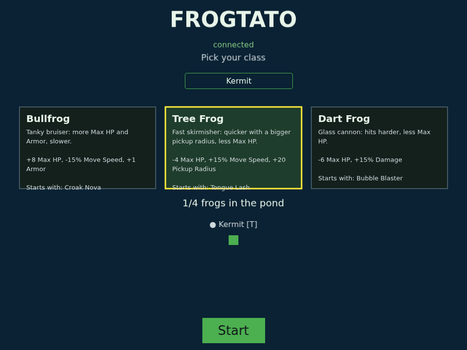
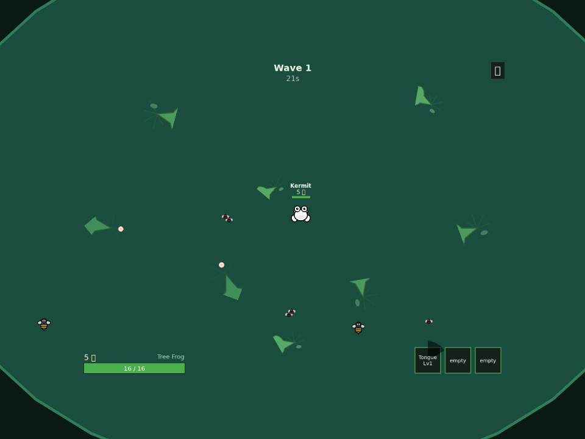
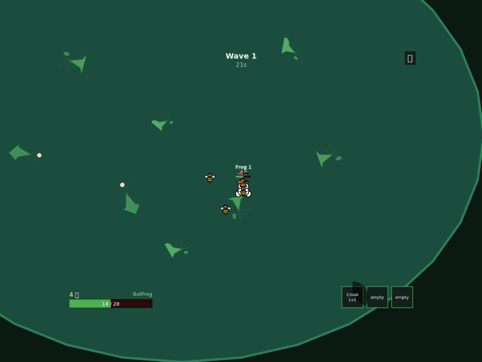
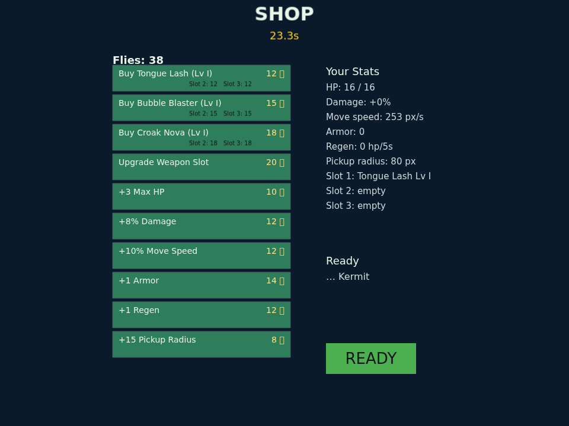
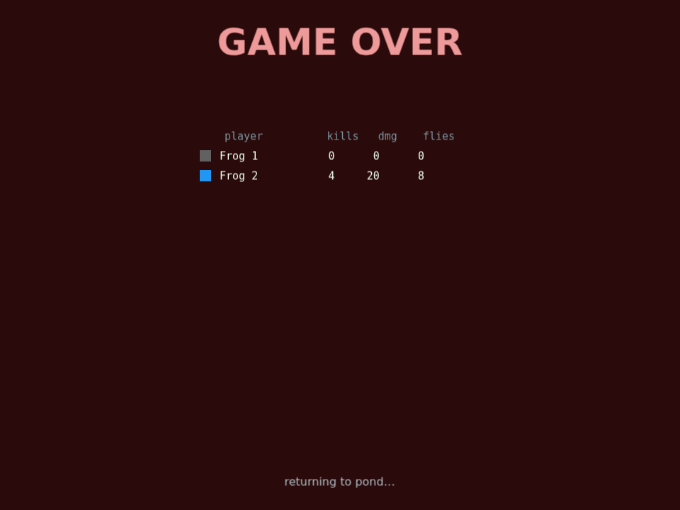

# Frogtato 🐸

A browser-based co-op arena survival game ("Brotato-like") where you play a
frog in a pond. 1–4 players share one arena over a LAN, auto-firing weapons
at waves of bugs, spending flies in a shop between waves, and facing the
**Snail King** at the end of wave 5.

Built as an npm-workspaces monorepo with a fully server-authoritative
simulation: the server runs all game logic at 30 Hz; the browser client
(Phaser 3) renders snapshots and sends inputs, nothing more.

## Features (v0.2)

- **3 frog classes** — Bullfrog (tanky, starts with Croak Nova), Tree Frog
  (fast, Tongue Lash), Dart Frog (glass cannon, Bubble Blaster)
- **3 weapons × 3 levels, 3 slots** — Tongue Lash (melee), Bubble Blaster
  (ranged, leads its shots), Croak Nova (AoE); duplicate same-level weapons
  **merge** into the next level for free
- **4 enemies** — Wasp (chaser), Snail Spitter (ranged), Heron (telegraphed
  dive-swoop, wave 3+), and the Snail King boss finale (spread shots + shell
  phases)
- **5 timed waves** with a between-wave shop: weapons, upgrades, and six
  stats (Max HP, Damage, Move speed, Armor, Regen, Pickup radius)
- **Co-op niceties** — player names, downed/revive, team-wipe game over,
  end-of-run scoreboard, rematch keeps your class, refresh-proof reconnect
  (2-minute grace), music + SFX (all synthesized in-repo)

## Screenshots

| Lobby — pick a class, set your name | Wave 1 — kiting wasps in the pond |
|---|---|
|  |  |

| Swarmed! Croak Nova about to fire | The shop between waves |
|---|---|
|  |  |

| Team wipe — end-of-run scoreboard |
|---|
|  |

*(Captured from the real game via headless Chromium driving a scripted
frog — the same approach the repo's check suites use, one layer up.)*

## Quick start

```bash
npm install
npm run dev
```

Then every player opens `http://<host-ip>:5173` (the dev server listens on
the LAN; up to 4 players). Pick a class and a name in the lobby — anyone can
press **Start**.

**Controls:** WASD / arrow keys to move. Weapons aim and fire automatically.
Speaker icon (top right) toggles sound.

**A run:** survive 5 timed waves. Enemies drop flies; between waves, spend
them in the shop (30 s, or until everyone clicks Ready). Downed frogs revive
when the next wave starts — if the whole team is down at once, the run ends.
Wave 5 ends with the Snail King: kill it (or survive its 30-second enrage
window) to win.

## Commands (repo root)

| Command | What it does |
|---|---|
| `npm run dev` | Server (`tsx watch`, ws on :8080) + client (Vite on :5173, LAN-exposed) |
| `npm run build` | Builds all three workspaces |
| `npm run typecheck` | `tsc -b` across the project references |
| `npm run test -w shared` / `-w client` | Unit tests (vitest) |
| `npm run check:skeleton` … `check:boss` | Headless end-to-end suites (see below) |
| `node scripts/balance-probe.mjs` | Bot-measured balance numbers (boss kill-time, class survival) |

### End-to-end check suites

Seven headless suites drive real bot clients against a live server:
`skeleton` (netcode/movement/reconnect/rate-cap), `combat`, `weapons`,
`loop` (a full accelerated 5-wave game), `shop`, `class`, `boss`.

- `loop`/`shop`/`class`/`boss` spawn their own server; `skeleton`/`combat`/
  `weapons` expect one running.
- `PORT=<n>` overrides the server's listen port; `FROGTATO_PORT=<n>` points
  a check at it. Use a fresh server per suite — stale room state causes
  false failures.
- The suites rely on a dev-only `{type:"debug", ...}` websocket message
  (timescale, invincible, give weapon, grant flies, kill enemy) which is
  disabled when `NODE_ENV=production`.

## Project structure

```
shared/   TS types + constants: every balance number and protocol shape.
          The single source of truth — server and client both import it.
server/   Node + ws. Authoritative sim: 30 Hz fixed-step loop, 20 Hz
          snapshots. Rooms, phases, waves, combat, shop, reconnect grace.
client/   Phaser 3 + Vite. Renders interpolated snapshots (~100 ms delay),
          sends inputs. No gameplay rules client-side. Assets (SVG sprites,
          synthesized WAVs) live in client/assets/.
scripts/  Headless check suites + balance probe (plain Node + ws).
```

## Documentation

- `DESIGN.md` — v0.1 game design (core loop, weapons, waves, netcode)
- `DESIGN-PHASE2.md` — v0.2 design (classes, new stats, merging, heron, boss)
- `PLAN.md` — the agent-task implementation plan both phases were built from
- `BALANCE-NOTES.md` — bot-measured balance findings + live-playtest tuning log

Balance lives entirely in `shared/src/constants.ts` — search `TUNING` for
the knobs that came from playtesting rather than the design docs.

## How it was built

The game was designed and built in a single Claude Code session (2026-07-03
→ 07-04): the orchestrating model wrote the design docs, cut them into
agent-sized tasks with strict file ownership, and dispatched a fleet of
Sonnet subagents — then fixed live-playtest bugs interactively the next
morning.

Fleet telemetry (from the 21 delegated subagent tasks; excludes the
orchestrator's own usage):

| Phase | Subagent tasks | Output tokens | Tool calls | Agent compute |
|---|---|---|---|---|
| v0.1 (T1–T12) | 15 | ~1.40 M | 683 | ~2.6 h |
| v0.2 (P1–P5) | 5 | ~0.83 M | 401 | ~1.4 h |
| Playtest support | 1 | ~0.12 M | 54 | ~9 min |
| **Total** | **21** | **~2.35 M** | **1,138** | **~4.1 h** |

Peak concurrency was 3 agents; every task landed with machine-verified
acceptance (typecheck + unit tests + the headless check suites), and the
cross-agent contract drifts that did occur were caught by agents flagging
them rather than silently breaking. Final state: 29 commits, ~11.5 k lines
of TypeScript, 135 unit tests, 7 end-to-end suites.

## Version history

- **v0.1.0** — complete 5-wave co-op game per `DESIGN.md`
- **v0.2.0** — Phase 2 per `DESIGN-PHASE2.md`: classes, armor/regen/pickup
  stats, weapon merging, heron, Snail King, names
- **main since v0.2.0** — live-playtest hardening: 6 bug fixes (input-seq
  lockout after reconnect, shop-exit routing, listener starvation,
  scene-restart corruption, class-loadout slot truncation, unhittable
  herons) and balance tuning (wasp speed, hit-stagger, snail containment,
  2→3 weapon slots, ~doubled fly economy, bubble intercept lead)
